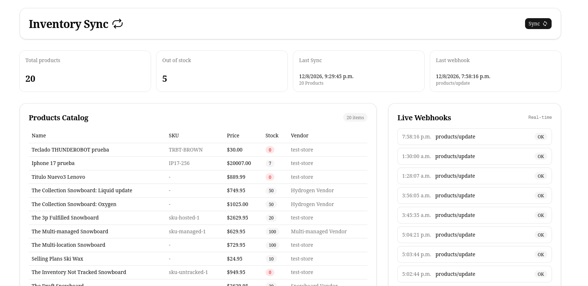
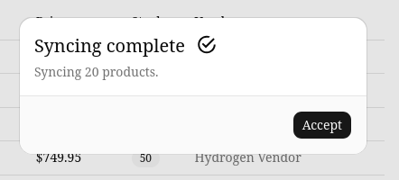

# Shopify Inventory Sync 🔄


> 🇲🇽 Español | 🇺🇸 [English](#english-version)

## 🇲🇽 Español

### Descripción del Proyecto

**Shopify Inventory Sync** es una aplicación full stack que mantiene una copia local en PostgreSQL del catálogo de productos de una tienda Shopify. Resuelve un problema común de integraciones e-commerce: tener los datos de productos disponibles fuera de Shopify para generar reportes, conectarse con otros sistemas (ERPs, BI, etc) o construir funcionalidades propias sin depender de llamar a la API de Shopify en cada request.

La sincronización ocurre de dos formas complementarias: una sincronización manual completa vía GraphQL, y actualizaciones automáticas en tiempo real vía webhooks cada vez que un producto cambia en Shopify.

### 🔌 Cómo funciona la conexión con Shopify

```
Shopify Admin API (GraphQL) ←──── Sincronización manual (pull)
        │
        ▼
   Express Backend ────► PostgreSQL (Prisma)
        ▲
        │
Shopify Webhooks ────────► Actualización automática (push)
```

**Flujo de sincronización manual (pull):**

1. El usuario da click en "Sincronizar" desde el dashboard
2. El backend consulta la Admin API vía GraphQL, paginando con cursores (`first` / `after`) para traer todos los productos sin golpear los límites de rate
3. Cada producto se guarda con `upsert` — si ya existe se actualiza, si no se crea
4. Se registra la corrida en `SyncHistory`

**Flujo de actualización automática (push):**

1. Un producto se edita en el admin de Shopify
2. Shopify dispara un webhook `products/update` hacia la URL pública registrada
3. El backend verifica la firma **HMAC-SHA256** del header `X-Shopify-Hmac-Sha256` contra el body crudo de la request, usando el API secret de la app — esto confirma que la petición viene realmente de Shopify
4. Se verifica idempotencia con el header `X-Shopify-Webhook-Id` — si ya se procesó ese webhook, se ignora (Shopify puede reenviar el mismo evento más de una vez)
5. Se actualiza solo ese producto en la base de datos
6. Se registra el evento en `WebhookLog` con su resultado (`OK`, `ERROR`, `DUPLICATE`)

### 🛠️ Tech Stack

#### Backend

| Tecnología                  | Uso                                      |
| --------------------------- | ---------------------------------------- |
| Node.js + Express           | Servidor y API REST                      |
| TypeScript                  | Tipado estático                          |
| Prisma ORM                  | Manejo de base de datos                  |
| PostgreSQL                  | Base de datos relacional                 |
| Shopify Admin API (GraphQL) | Consulta y sincronización de productos   |
| Shopify Webhooks            | Actualizaciones en tiempo real           |
| HMAC-SHA256                 | Verificación de autenticidad de webhooks |

#### Frontend

| Tecnología              | Uso                        |
| ----------------------- | -------------------------- |
| Next.js 15 (App Router) | Framework de React con SSR |
| TypeScript              | Tipado estático            |
| Tailwind CSS            | Estilos utilitarios        |
| shadcn/ui               | Componentes de interfaz    |

### 📁 Estructura del Proyecto

```
Shopify-Inventory-Sync/
├── docker-compose.yml
│
├── backend/
│   ├── prisma/
│   │   ├── migrations/
│   │   └── schema.prisma
│   ├── src/
│   │   ├── config/
│   │   ├── controllers/
│   │   │   ├── product.controllers.ts
│   │   │   ├── sync.controllers.ts
│   │   │   └── webhook.controllers.ts
│   │   ├── routes/
│   │   │   ├── product.routes.ts
│   │   │   ├── sync.routes.ts
│   │   │   └── webhook.routes.ts
│   │   ├── services/
│   │   │   ├── shopify.service.ts
│   │   │   └── hmac.service.ts
│   │   ├── middleware/
│   │   │   └── verifyWebhook.ts
│   │   ├── lib/
│   │   │   └── prisma.ts
│   │   ├── generated/
│   │   └── index.ts
│   ├── .env
│   ├── Dockerfile
│   └── prisma.config.ts
│
└── frontend/
    └── src/
        ├── app/
        │   └── page.tsx
        ├── components/
        │   ├── StatsCards.tsx
        │   ├── SyncButton.tsx
        │   ├── ProductsTable.tsx
        │   └── WebhookHistory.tsx
        ├── lib/
        │   └── api.ts
        └── types/
            └── index.ts
```

### 📸 Screenshots

### Dashboard



### Sync



### ⚙️ Instalación y Configuración

#### Prerequisitos

- Node.js v18+
- pnpm
- Docker y Docker Compose
- Una tienda de desarrollo de Shopify (gratis vía [Shopify Partners](https://partners.shopify.com))
- ngrok (para exponer el backend localmente y recibir webhooks)

#### 1. Clonar el repositorio

```bash
git clone https://github.com/tu-usuario/shopify-inventory-sync.git
cd shopify-inventory-sync
```

#### 2. Crear una app en Shopify

En el admin de tu tienda de desarrollo:

```
Settings → Apps and sales channels → Develop apps → Create an app
```

Configura los scopes necesarios (`read_products`) y genera dos credenciales:

- **Admin API access token** — para las queries/mutations GraphQL
- **API secret key** — para verificar la firma HMAC de los webhooks

#### 3. Configurar variables de entorno

Crea un archivo `.env` en la carpeta `backend/`:

```env
DATABASE_URL=postgresql://postgres:postgres@db:5432/inventory_sync
SHOPIFY_STORE=tu-tienda.myshopify.com
SHOPIFY_ADMIN_TOKEN=shpat_tu_token
SHOPIFY_API_SECRET=tu_api_secret_key
PORT=4000
CLIENT_URL=http://localhost:3000
```

#### 4. Levantar el stack completo

Desde la raíz del proyecto:

```bash
docker compose up --build
```

Esto levanta PostgreSQL, el backend, el frontend y Adminer.

#### 5. Ejecutar las migraciones

```bash
docker compose exec backend pnpm exec prisma migrate dev --name init
docker compose exec backend pnpm exec prisma generate
```

#### 6. Exponer el backend con ngrok

```bash
ngrok http 4000
```

#### 7. Registrar el webhook

Con la URL pública de ngrok, registra la suscripción vía GraphQL:

```bash
curl -X POST \
  https://tu-tienda.myshopify.com/admin/api/2026-07/graphql.json \
  -H 'Content-Type: application/json' \
  -H 'X-Shopify-Access-Token: shpat_tu_token' \
  -d '{
    "query": "mutation webhookSubscriptionCreate($topic: WebhookSubscriptionTopic!, $webhookSubscription: WebhookSubscriptionInput!) { webhookSubscriptionCreate(topic: $topic, webhookSubscription: $webhookSubscription) { webhookSubscription { id callbackUrl } userErrors { field message } } }",
    "variables": {
      "topic": "PRODUCTS_UPDATE",
      "webhookSubscription": {
        "callbackUrl": "https://tu-url-de-ngrok.ngrok-free.app/webhooks/products-update",
        "format": "JSON"
      }
    }
  }'
```

### 🖥️ Acceso a los servicios

| Servicio             | URL                   |
| -------------------- | --------------------- |
| Frontend (Dashboard) | http://localhost:3000 |
| Backend API          | http://localhost:4000 |
| Adminer (DB GUI)     | http://localhost:8080 |

### 🔌 Endpoints de la API

| Método | Endpoint                    | Descripción                              | Auth |
| ------ | --------------------------- | ---------------------------------------- | ---- |
| GET    | `/products`                 | Listar productos sincronizados           | ❌   |
| GET    | `/products/stats`           | Métricas del dashboard                   | ❌   |
| POST   | `/sync`                     | Disparar sincronización manual completa  | ❌   |
| GET    | `/webhooks/logs`            | Historial de webhooks recibidos          | ❌   |
| POST   | `/webhooks/products-update` | Recibe webhooks de Shopify (uso interno) | HMAC |

### 🗄️ Modelo de Base de Datos

```
Product
  ├── shopifyId (unique)
  ├── title, price, sku, inventoryQty, vendor, status
  └── createdAt, updatedAt

WebhookLog
  ├── webhookId (unique) — para idempotencia
  ├── topic, shop, payload
  └── status (OK | ERROR | DUPLICATE)

SyncHistory
  ├── type (MANUAL | WEBHOOK | SCHEDULED)
  ├── productsSynced
  └── startedAt, finishedAt
```

### 🔄 Flujos Importantes

**Sincronización manual:**
Usuario da click en "Sincronizar" → backend pagina por todos los productos vía GraphQL → `upsert` en PostgreSQL por cada uno → se registra la corrida en `SyncHistory`

**Actualización vía webhook:**
Producto se edita en Shopify → Shopify envía `products/update` → se verifica HMAC → se verifica idempotencia por `webhookId` → se actualiza el producto → se registra en `WebhookLog`

**Verificación HMAC:**
Se captura el body crudo de la request (antes de que Express lo parsee como JSON) → se calcula un hash HMAC-SHA256 con el API secret → se compara con el header `X-Shopify-Hmac-Sha256` usando `crypto.timingSafeEqual` para evitar timing attacks

**Idempotencia:**
Cada webhook trae un `X-Shopify-Webhook-Id` único → si ya existe un registro con ese id en `WebhookLog`, la petición se marca como duplicada y no se reprocesa

---

<a name="english-version"></a>

## 🇺🇸 English Version

### Project Description

**Shopify Inventory Sync** is a full stack application that keeps a local PostgreSQL copy of a Shopify store's product catalog. It solves a common e-commerce integration problem: having product data available outside Shopify for reporting, connecting with other systems (ERPs, BI tools, etc), or building custom features without depending on calling the Shopify API on every request.

Synchronization happens in two complementary ways: a full manual sync via GraphQL, and automatic real-time updates via webhooks whenever a product changes in Shopify.

### 🔌 How the Shopify Connection Works

```
Shopify Admin API (GraphQL) ←──── Manual sync (pull)
        │
        ▼
   Express Backend ────► PostgreSQL (Prisma)
        ▲
        │
Shopify Webhooks ────────► Automatic update (push)
```

**Manual sync flow (pull):**

1. User clicks "Sync" on the dashboard
2. The backend queries the Admin API via GraphQL, paginating with cursors (`first` / `after`) to fetch all products without hitting rate limits
3. Each product is saved via `upsert` — updated if it exists, created if not
4. The run is logged in `SyncHistory`

**Automatic update flow (push):**

1. A product is edited in the Shopify admin
2. Shopify fires a `products/update` webhook to the registered public URL
3. The backend verifies the **HMAC-SHA256** signature from the `X-Shopify-Hmac-Sha256` header against the raw request body, using the app's API secret — this confirms the request genuinely came from Shopify
4. Idempotency is checked via the `X-Shopify-Webhook-Id` header — if that webhook was already processed, it's ignored (Shopify can resend the same event more than once)
5. Only that product is updated in the database
6. The event is logged in `WebhookLog` with its result (`OK`, `ERROR`, `DUPLICATE`)

### 🛠️ Tech Stack

#### Backend

| Technology                  | Usage                             |
| --------------------------- | --------------------------------- |
| Node.js + Express           | Server and REST API               |
| TypeScript                  | Static typing                     |
| Prisma ORM                  | Database management               |
| PostgreSQL                  | Relational database               |
| Shopify Admin API (GraphQL) | Product querying and sync         |
| Shopify Webhooks            | Real-time updates                 |
| HMAC-SHA256                 | Webhook authenticity verification |

#### Frontend

| Technology              | Usage                    |
| ----------------------- | ------------------------ |
| Next.js 15 (App Router) | React framework with SSR |
| TypeScript              | Static typing            |
| Tailwind CSS            | Utility-first styling    |
| shadcn/ui               | UI components            |

### 📸 Screenshots

### Dashboard


### Sync


### ⚙️ Installation & Setup

#### Prerequisites

- Node.js v18+
- pnpm
- Docker and Docker Compose
- A Shopify development store (free via [Shopify Partners](https://partners.shopify.com))
- ngrok (to expose the backend locally and receive webhooks)

#### 1. Clone the repository

```bash
git clone https://github.com/your-username/shopify-inventory-sync.git
cd shopify-inventory-sync
```

#### 2. Create a Shopify app

In your development store's admin:

```
Settings → Apps and sales channels → Develop apps → Create an app
```

Configure the necessary scopes (`read_products`) and generate two credentials:

- **Admin API access token** — for GraphQL queries/mutations
- **API secret key** — for verifying webhook HMAC signatures

#### 3. Configure environment variables

Create a `.env` file inside `backend/`:

```env
DATABASE_URL=postgresql://postgres:postgres@db:5432/inventory_sync
SHOPIFY_STORE=your-store.myshopify.com
SHOPIFY_ADMIN_TOKEN=shpat_your_token
SHOPIFY_API_SECRET=your_api_secret_key
PORT=4000
CLIENT_URL=http://localhost:3000
```

#### 4. Start the full stack

From the project root:

```bash
docker compose up --build
```

This starts PostgreSQL, the backend, the frontend, and Adminer.

#### 5. Run migrations

```bash
docker compose exec backend pnpm exec prisma migrate dev --name init
docker compose exec backend pnpm exec prisma generate
```

#### 6. Expose the backend with ngrok

```bash
ngrok http 4000
```

#### 7. Register the webhook

Using the public ngrok URL, register the subscription via GraphQL:

```bash
curl -X POST \
  https://your-store.myshopify.com/admin/api/2026-07/graphql.json \
  -H 'Content-Type: application/json' \
  -H 'X-Shopify-Access-Token: shpat_your_token' \
  -d '{
    "query": "mutation webhookSubscriptionCreate($topic: WebhookSubscriptionTopic!, $webhookSubscription: WebhookSubscriptionInput!) { webhookSubscriptionCreate(topic: $topic, webhookSubscription: $webhookSubscription) { webhookSubscription { id callbackUrl } userErrors { field message } } }",
    "variables": {
      "topic": "PRODUCTS_UPDATE",
      "webhookSubscription": {
        "callbackUrl": "https://your-ngrok-url.ngrok-free.app/webhooks/products-update",
        "format": "JSON"
      }
    }
  }'
```

### 🖥️ Service Access

| Service              | URL                   |
| -------------------- | --------------------- |
| Frontend (Dashboard) | http://localhost:3000 |
| Backend API          | http://localhost:4000 |
| Adminer (DB GUI)     | http://localhost:8080 |

### 🔌 API Endpoints

| Method | Endpoint                    | Description                          | Auth |
| ------ | --------------------------- | ------------------------------------ | ---- |
| GET    | `/products`                 | List synced products                 | ❌   |
| GET    | `/products/stats`           | Dashboard metrics                    | ❌   |
| POST   | `/sync`                     | Trigger full manual sync             | ❌   |
| GET    | `/webhooks/logs`            | Webhook history                      | ❌   |
| POST   | `/webhooks/products-update` | Receives Shopify webhooks (internal) | HMAC |

### 🗄️ Database Model

```
Product
  ├── shopifyId (unique)
  ├── title, price, sku, inventoryQty, vendor, status
  └── createdAt, updatedAt

WebhookLog
  ├── webhookId (unique) — for idempotency
  ├── topic, shop, payload
  └── status (OK | ERROR | DUPLICATE)

SyncHistory
  ├── type (MANUAL | WEBHOOK | SCHEDULED)
  ├── productsSynced
  └── startedAt, finishedAt
```

### 🔄 Key Flows

**Manual sync:**
User clicks "Sync" → backend paginates through all products via GraphQL → `upsert` in PostgreSQL for each → the run is logged in `SyncHistory`

**Webhook update:**
Product edited in Shopify → Shopify sends `products/update` → HMAC verified → idempotency checked by `webhookId` → product updated → event logged in `WebhookLog`

**HMAC verification:**
Raw request body is captured (before Express parses it as JSON) → an HMAC-SHA256 hash is computed with the API secret → compared against the `X-Shopify-Hmac-Sha256` header using `crypto.timingSafeEqual` to prevent timing attacks

**Idempotency:**
Each webhook carries a unique `X-Shopify-Webhook-Id` → if a record with that id already exists in `WebhookLog`, the request is marked as duplicate and not reprocessed
